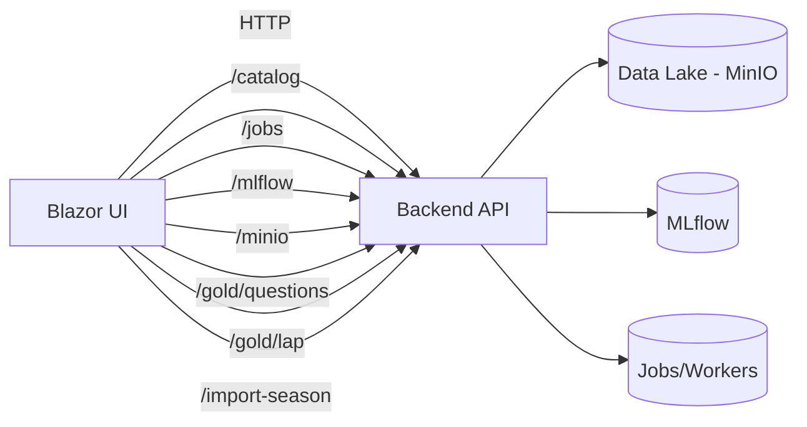

# F1_MlFlow — Visão Geral da Aplicação

## 1. Objetivo
O F1_MlFlow é um portal analítico e operacional para observar o pipeline de dados em camadas **Bronze / Silver / Gold**, além de monitorar **Jobs**, **MLflow**, **MinIO**, **Health** e permitir **perguntas ao Gold**. Ele também expõe uma interface para **importar uma temporada** via backend.

---

## 2. Stack e Arquitetura
- **Blazor Web App** com **InteractiveServer**.
- Consumo de APIs backend via `HttpClient` configurado em `ApiSettings:BaseUrl`.
- Componentização por área (Dashboard, Jobs, MinIO, MLflow, Gold, etc).
- Cache em memória por sessão/circuito via `UiCacheService`.

Fluxo geral:
1. Usuário navega pelo menu lateral.
2. O banner de carregamento aparece imediatamente.
3. A página renderiza o layout e em seguida carrega dados assíncronos via APIs.

---

## 3. Configuração (appsettings.json)

### ApiSettings
- `BaseUrl`: base do backend (ex.: `http://localhost:7077`)
- `UseMockData`: atualmente não usado nas páginas principais.

### BackendDependencies
Utilizado para exibir contexto/configuração e para montar links do MinIO:
- `DataLakeBucket` (ex.: `openf1-datalake`)
- `DataLakeS3EndpointUrl` (ex.: `http://localhost:9000`)
- `DataLakePrefix`
- `DataLakeSubdirs`
- `DataLakeDownloadSubdirs`
- `MlflowTrackingUri`
- `MlflowS3EndpointUrl`
- `MlflowExperimentId`

### AdminSettings
Usado pelo `AdminGuard` para liberar telas administrativas:
- `EnableAdminGate`
- `AccessKey`

---

## 4. Páginas e Funcionalidades

### Home (`/`)
Resumo rápido com KPIs e CTA para as áreas principais.
Carrega:
- Health (latência)
- Jobs ativos
- Runs MLflow
- Contagens Bronze/Silver/Gold

### Dashboard (`/dashboard`)
Painel operacional com:
- KPIs (bronze/silver/gold, jobs, MLflow)
- Health e dependências
- Jobs recentes
- MinIO recentes
- Qualidade do Gold
- Ranking de pilotos

APIs usadas:
- `GET /health`
- `GET /health/dependencies`
- `GET /jobs`
- `GET /mlflow/runs?limit=50`
- `GET /minio/objects`
- `GET /catalog/bronze?season=YYYY`
- `GET /catalog/silver?season=YYYY`
- `GET /catalog/gold?season=YYYY`
- `POST /driver-profiles/season` (se disponível)

### Catálogo de Dados (`/data-catalog`)
Abas Bronze/Silver/Gold com filtros de **Season** e **Limite**.
Também permite exportação CSV.

APIs usadas:
- `GET /catalog/bronze?limit=N&season=YYYY&check_sync=false|true`
- `GET /catalog/silver?limit=N&season=YYYY`
- `GET /catalog/gold?limit=N&season=YYYY&include_schema=true|false`

### Jobs (`/jobs`)
Lista de jobs, filtros por status/tipo, detalhes e logs.
Status `waiting` aparece em azul.

APIs usadas:
- `GET /jobs`
- `GET /jobs/{jobId}`
- `GET /jobs/{jobId}/logs?lines=N`

### MLflow (`/mlflow`)
Lista de runs, comparação, métricas, parâmetros e artefatos.

APIs usadas:
- `GET /mlflow/runs?limit=N`

### MinIO (`/minio`)
Exploração de objetos no data lake com filtros e ações rápidas.
Os links para arquivos são normalizados para o **MinIO Console**:
`http://localhost:9001/browser/<bucket>/<path>`.

APIs usadas:
- `GET /minio/objects?limit=N`

### Perguntas ao Gold (`/gold-questions`)
Perguntas em linguagem natural com contexto (season, meeting, session, driver).
Histórico fica em `localStorage` e pode ser apagado.

APIs usadas:
- `POST /gold/questions`

### Gold · Consulta de Volta (`/gold-lap`)
Busca uma volta específica por `season` + `lap_number`
Opcionalmente filtra por `meeting_key` ou `meeting_name`.

APIs usadas:
- `GET /gold/lap?season=YYYY&lap_number=N&meeting_key=...`
- `GET /gold/lap?season=YYYY&lap_number=N&meeting_name=...`

### Diagnósticos (`/diagnostics`)
Health check da API e dependências, com testes manuais.

APIs usadas:
- `GET /health`
- `GET /health/dependencies`
- `GET /mlflow/runs?limit=50`
- `GET /minio/objects?limit=200`
- `GET /jobs`
- `GET /catalog/bronze?limit=500&season=YYYY&check_sync=false`

### Importar Season (`/import-season`)
Dispara a importação de uma temporada com parâmetros de execução.

Request:
```json
{
  "season": 2026,
  "session_name": "Race",
  "include_llm": true,
  "llm_endpoint": "http://mlflow:5000/gateway/endpoint_mlflow/mlflow/invocations",
  "resume_job_id": "job_id_aqui"
}
```

Response:
```json
{
  "status": "queued|running|failed|completed",
  "job_id": "string",
  "message": "string|null"
}
```

APIs usadas:
- `POST /import-season`

---

## 5. UX de Carregamento
- Banner global: “Aguarde. Carregamento em andamento.”
- Aparece ao clicar no menu lateral (navegação).
- Também aparece quando páginas estão carregando dados.

---

## 6. Cache e Performance
Algumas páginas fazem cache temporário (por sessão/circuito) para evitar cargas repetidas:
- Dashboard: 30s
- Data Catalog: 60s
- MLflow/MinIO/Jobs: ~30–60s

Cache é **in-memory** (não persiste entre reinícios).

---

## 7. Observações importantes
- O backend deve expor os endpoints mencionados.
- A base do backend é configurada em `ApiSettings:BaseUrl`.
- Se o MinIO Console estiver em outra porta que não 9001, ajuste `DataLakeS3EndpointUrl` ou revise a regra de normalização no serviço `MinioApiService`.

---

## 8. Diagrama de Fluxo (Mermaid)


---

## 9. Como Rodar Localmente
Pré-requisitos:
- .NET SDK instalado (compatível com o projeto).
- Backend disponível no `ApiSettings:BaseUrl`.

Comandos:
```bash
dotnet restore
dotnet run --project F1_MlFlow/F1_MlFlow.csproj
```

Opcional (definir URL local):
```bash
set ASPNETCORE_URLS=http://localhost:5157
dotnet run --project F1_MlFlow/F1_MlFlow.csproj
```

---

## 10. Build e Deploy (publicação)
```bash
dotnet publish -c Release -o out
```

Executar o binário publicado:
```bash
dotnet out/F1_MlFlow.dll
```
