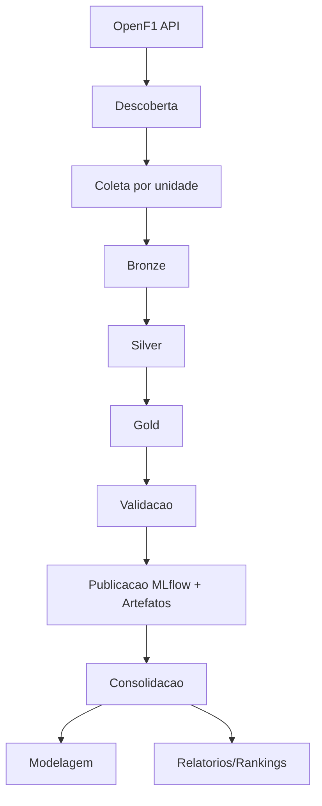
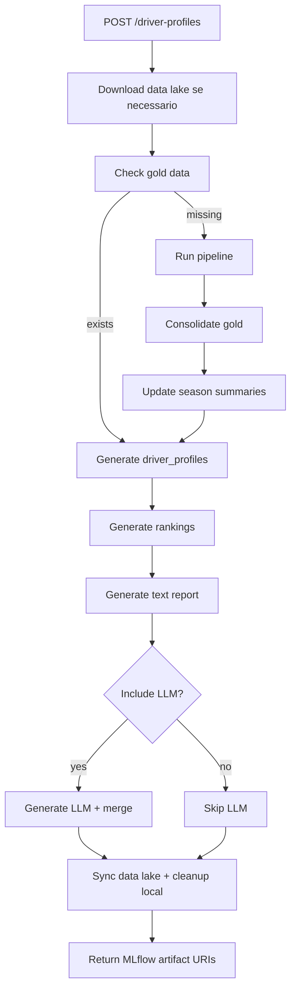
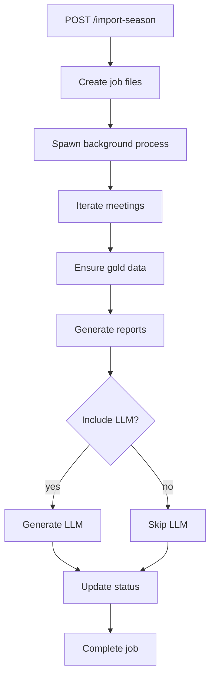
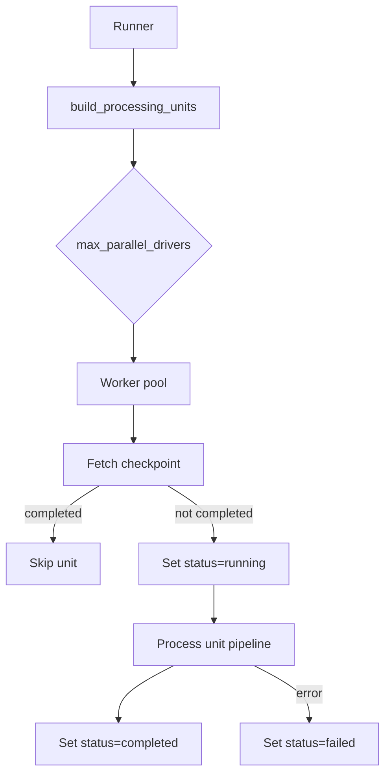
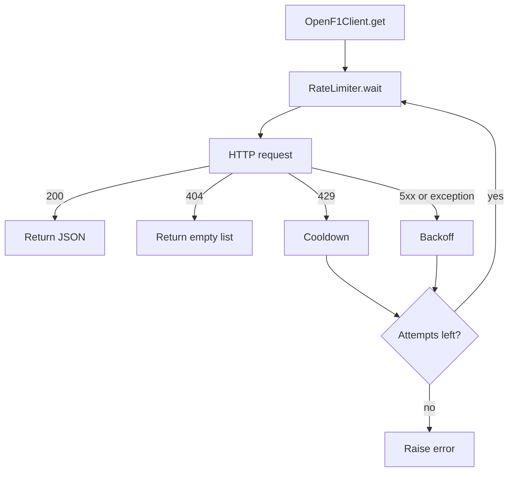

Documentacao do Sistema OpenF1 Dataset Builder
Esta documentacao descreve arquitetura, modulos, fluxo de dados, configuracao, operacao e detalhes dos jobs e da API. O README de uso rapido fica em `F1.OpenF1.DatasetBuilder/README.md`.

**Visao Geral**
A solucao coleta dados da API OpenF1, organiza em camadas bronze/silver/gold, valida qualidade, publica no MLflow e executa jobs de modelagem e relatorios analiticos. Ha tambem uma API FastAPI para orquestrar a geracao de relatorios e importacao de temporadas com status e logs.

**Arquitetura Funcional**
Fluxo macro:
1. Descoberta dinamica de meetings, sessions e drivers.
2. Coleta de endpoints por unidade de processamento.
3. Persistencia em bronze (raw).
4. Normalizacao em silver.
5. Engenharia de atributos e gold (dataset analitico).
6. Validacao de qualidade.
7. Publicacao de artefatos e metricas no MLflow.
8. Consolidacao, modelagem, rankings e relatorios.

**Diagramas E Fluxos**
Fluxo macro do pipeline:
```text
OpenF1 API
  -> Descoberta (meetings/sessions/drivers)
    -> Coleta por unidade
      -> Bronze (raw)
        -> Silver (normalizado)
          -> Gold (features por volta)
            -> Validacao
              -> Publicacao (MLflow + artefatos)
                -> Consolidacao/Modelagem/Relatorios
```

Fluxo macro do pipeline (Mermaid):


Fluxo por unidade de processamento:
```text
(season, meeting_key, session_key, driver_number)
  -> coleta laps
  -> coleta car_data
  -> coleta location
  -> coleta stints
  -> coleta weather
  -> escreve bronze (5 datasets)
  -> normaliza (silver)
  -> gera features e gold
  -> valida qualidade
  -> registra MLflow
  -> checkpoint completed
```

Fluxo da API `/driver-profiles`:
```text
POST /driver-profiles
  -> tenta baixar gold do data lake (quando faltarem)
  -> verifica dados gold (season/meeting/session)
  -> se faltando: executa pipeline e consolida gold
  -> atualiza resumo das temporadas (2023-2026) em f1_dataset/data/reports/season_summaries.json
  -> gera driver_profiles.csv
  -> gera rankings e texto
  -> opcional: gera LLM e merge
  -> sincroniza bronze/silver/gold com o data lake e limpa locais (se habilitado)
  -> responde com URIs de artifacts no MLflow
```

Fluxo da API `/driver-profiles` (Mermaid):


Fluxo da API `/gold/questions`:
```text
POST /gold/questions
  -> carrega gold consolidado (download do data lake se necessario)
  -> aplica filtros (season/meeting/session/driver)
  -> monta resumo estatistico do gold filtrado (inclui fastest/slowest, records, quantis e cobertura)
  -> se pergunta sobre volta mais rapida: resposta deterministica
  -> tenta responder via DuckDB (LLM gera SQL -> executa -> resposta)
  -> chama LLM via MLflow Gateway
  -> se resposta for "Sem dados no gold.": tenta fallback web (DuckDuckGo)
  -> se resposta nao estiver em pt-BR: reforca prompt e aplica fallback deterministico
  -> retorna answer + summary
```

Fluxo da API `/train/stint-delta-pace` (Machine Learning):
```text
POST /train/stint-delta-pace
  -> cria job_id e arquivos de status/log
  -> executa treino em background
  -> aplica filtros (season/meeting/session/driver/constructor)
  -> gera artefatos e metrics.json
  -> atualiza status com metrics e artifacts_dir
```

Fluxo da API `/gold/meetings`:
```text
GET /gold/meetings
  -> carrega gold consolidado
  -> filtra por season/session_name (opcional)
  -> agrupa meeting_key + meeting_name + sessions
  -> retorna lista de meetings existentes no gold
```

Fluxo da API `/gold/laps/max`:
```text
GET /gold/laps/max
  -> carrega gold consolidado
  -> filtra por season/meeting/session
  -> calcula max(lap_number)
  -> retorna max_lap_number
```

Fluxo da API `/gold/lap`:
```text
GET /gold/lap
  -> carrega gold consolidado
  -> filtra por season/meeting/session
  -> calcula lap_duration_total por piloto (cumsum)
  -> gera lap_duration_min, lap_duration_total e lap_duration_gap formatados
  -> filtra pela lap_number solicitada
  -> ordena por lap_duration_total
  -> retorna dados de todos os pilotos
```

Fluxo da API `/import-season`:
```text
POST /import-season
  -> cria job_id e arquivos de status/log
  -> executa importacao em background
  -> para cada meeting: garante gold, gera relatorios, opcional LLM
  -> atualiza status com progresso por meeting
```

Fluxo da API `/import-season` (Mermaid):


Fluxo da API `/import-season/resume`:
```text
POST /import-season/resume
  -> carrega status do job anterior
  -> cria novo job_id e arquivos de status/log
  -> marca job anterior como resumed (resumed_job_id)
  -> reutiliza season e session_name do job anterior
  -> pula meetings ja concluidos (ok/skipped)
  -> reprocessa meetings restantes e opcional LLM
  -> atualiza status com progresso por meeting
  -> se encontrar etapa futura: status=waiting + next_meeting e encerra
```

Paralelismo e checkpoints:
```text
Runner
  -> build_processing_units()
  -> cria N workers (max_parallel_drivers)
    -> para cada unidade:
      -> consulta checkpoint
      -> se status=completed: skip
      -> status=running
      -> processa pipeline da unidade
      -> status=completed
      -> se erro: status=failed
```

Paralelismo e checkpoints (Mermaid):


Retry, backoff e rate limiting:
```text
OpenF1Client.get()
  -> wait(min_request_interval_ms)
  -> request
    -> 429: cooldown + retry
    -> 5xx: backoff + retry
    -> 404: retorna vazio
    -> 200: retorna dados
  -> apos N tentativas: erro
```

Retry, backoff e rate limiting (Mermaid):


**Componentes Principais**
- `clients/`: clientes HTTP para OpenF1 e MLflow.
- `discovery/`: descoberta de meetings, sessions e drivers.
- `collectors/`: coleta de endpoints brutos.
- `processors/`: normalizacao e limpeza basica.
- `feature_engineering/`: agregacoes por volta e features.
- `validators/`: validacao de qualidade do gold.
- `publishers/`: escrita de datasets e publicacao no MLflow.
- `orchestration/`: runner, paralelismo e checkpoints.
- `modeling/`: utilitarios de dataset e pre-processamento.
- `jobs/`: scripts de pipeline, modelagem e relatorios.
- `api/`: FastAPI para orquestracao de relatorios e jobs.

**Unidade De Processamento**
Unidade logica: `(season, meeting_key, session_key, driver_number)`.
Isso permite reprocessar apenas um piloto em uma sessao especifica, com checkpoint independente.

**Orquestracao E Resiliencia**
Arquivos principais: `f1_dataset/src/orchestration/runner.py`, `f1_dataset/src/orchestration/checkpoint_store.py`.
Mecanismos:
- Paralelismo controlado por `execution.max_parallel_drivers`.
- Rate limiting por `execution.min_request_interval_ms`.
- Retry e backoff exponencial por `execution.retry_attempts` e `execution.retry_backoff_seconds`.
- Cooldown em caso de HTTP 429 por `execution.rate_limit_cooldown_seconds`.
- Checkpoints por unidade processada para retomar execucoes.

**Camadas De Dados**
Bronze:
- Dados crus por endpoint (`laps`, `car_data`, `location`, `stints`, `weather`).
- Uso principal: auditoria e replay.
Silver:
- JSON achatado, tipos e datas padronizadas.
Gold:
- Dataset analitico por volta, pronto para modelagem.

**Modelo Gold**
Colunas base:
- Identificadores e contexto: `season`, `meeting_key`, `meeting_name`, `meeting_date_start`, `session_key`, `session_name`, `driver_number`, `driver_name`, `team_name`.
- Volta e alvo: `lap_number`, `lap_duration`, `duration_sector_1`, `duration_sector_2`, `duration_sector_3`.
- Indicadores adicionais: `i1_speed`, `i2_speed`, `st_speed`, `is_pit_out_lap`.

Features de telemetria:
- `avg_speed`, `max_speed`, `min_speed`, `speed_std`.
- `avg_rpm`, `max_rpm`, `min_rpm`, `rpm_std`.
- `avg_throttle`, `max_throttle`, `min_throttle`, `throttle_std`.

Features de controle do carro:
- `full_throttle_pct`, `brake_pct`, `brake_events`, `hard_brake_events`.
- `drs_pct`, `gear_changes`.

Features de trajetoria:
- `distance_traveled`, `trajectory_length`, `trajectory_variation`.

Flags e cobertura de dados:
- `telemetry_points`, `trajectory_points`, `has_telemetry`, `has_trajectory`.

Contexto de stint:
- `stint_number`, `compound`, `stint_lap_start`, `stint_lap_end`.
- `tyre_age_at_start`, `tyre_age_at_lap`.

Clima por volta (quando disponivel):
- `track_temperature`, `air_temperature`, `weather_date`.

**Validacao De Qualidade**
Arquivo: `f1_dataset/src/validators/quality.py`.
Metricas:
- `rows`: total de linhas do gold.
- `null_pct`: percentual medio de nulos.
- `valid_laps`: voltas com `lap_number` valido.
- `discarded_laps`: linhas descartadas por falta de `lap_number`.
Uso: garantir completude minima antes de publicar e modelar.

**Publicacao E MLflow**
Arquivo: `f1_dataset/src/publishers/mlflow_publisher.py`.
Registros principais:
- Parametros da execucao (temporada, meeting, session, driver).
- Metricas de qualidade do gold.
- Artefatos: parquet/csv, relatorio de qualidade, amostras e logs.
Objetivo: rastreabilidade, reproducibilidade e comparacao entre execucoes.

**Jobs Do Sistema**
Pipeline e consolidacao:
- `build_openf1_dataset.py`: executa o pipeline completo por unidades.
- `process_meeting.py`: processa um meeting especifico.
- `consolidate_gold_dataset.py`: consolida gold em um unico arquivo.
- `update_season_summaries.py`: gera `f1_dataset/data/reports/season_summaries.json` (temporadas 2023-2026).
- `batch_import_season.py`: gera configs por batches e opcionalmente executa o pipeline.

Modelagem e analytics:
- `train_lap_time_regression.py`: regressao de tempo de volta.
- `train_lap_time_ranking.py`: regressao + ranking de pilotos.
- `train_relative_position.py`: predicao de rank_percentile.
- `train_stint_delta_pace.py`: delta de pace entre stints.
- `train_tyre_degradation.py`: degradacao de pneus.
- `train_lap_quality_classifier.py`: classificacao de qualidade de volta.
- `train_lap_anomaly.py`: deteccao de anomalias por volta.
- `train_driver_style_clustering.py`: clustering de estilo de pilotagem.
- `train_circuit_segmentation.py`: segmentacao de circuitos.
- `compare_lap_time_runs.py`: comparacao dos modelos de lap time no MLflow.
- `compare_extended_experiments.py`: comparacao de experimentos estendidos.

Relatorios e rankings:
- `driver_profiles_report.py`: gera metricas consolidadas por piloto.
- `driver_profiles_rankings.py`: rankings por metrica.
- `driver_profiles_overall_ranking.py`: ranking geral por score composto.
- `driver_profiles_text_report.py`: resumo textual baseado em percentis.
- `generate_driver_performance_llm.py`: texto por piloto via MLflow Gateway.
- `import_season_job.py`: executor do job assincrono criado pela API.

**Metricas Modelagem**
Regressoes (`train_lap_time_regression`, `train_lap_time_ranking`, `train_relative_position`, `train_stint_delta_pace`, `train_tyre_degradation`):
- `mae`, `rmse`, `r2`, `mape`.
Motivo: medir erro absoluto, penalizar erros grandes, variancia explicada e erro relativo.

Ranking de lap time (`train_lap_time_ranking`):
- `rank_spearman_mean`, `rank_ndcg_mean`, `rank_meeting_count`, `rank_driver_mean`.
Motivo: avaliar concordancia de ordenacao e qualidade do ranking por corrida.

Classificacao (`train_lap_quality_classifier`):
- `accuracy`, `precision`, `recall`, `f1`, `roc_auc`.
Motivo: medir performance global, equilibrio entre classes e poder discriminativo.

Anomalias (`train_lap_anomaly`):
- `rows`, `anomaly_count`, `anomaly_rate`, `score_min`, `score_max`, `score_mean`.
Motivo: quantificar incidencia e distribuicao do score.

Clustering (`train_driver_style_clustering`, `train_circuit_segmentation`):
- `clusters`, `rows`, `silhouette`, `davies_bouldin`.
Motivo: avaliar coesao e separacao dos grupos.

**Metricas Pilotos**
Saida principal: `driver_profiles.csv`.
Metricas agregadas por piloto:
- Ritmo e consistencia: `lap_mean`, `lap_std`, `lap_mean_delta_to_meeting_mean`, `lap_mean_z_to_meeting_mean`, `meeting_lap_mean_avg`.
- Qualidade e estabilidade: `lap_quality_good_rate`, `lap_quality_bad_rate`, `anomaly_rate`.
- Desgaste e stints: `degradation_mean`, `degradation_p95`, `degradation_slope` (performance ao longo do stint), `stint_performance_delta_mean`, `stint_performance_delta_slope` (aliases com nome mais claro), `tyre_wear_slope` (desgaste isolado), `delta_pace_mean`, `delta_pace_median`, `delta_pace_std`, `delta_pace_count`.
- Posicionamento relativo: `rank_percentile_mean`, `rank_percentile_median`.
- Confiabilidade: `finish_rate`, `lap_completion_mean`, `dnf_rate`.
- Resultados: `points_total`, `points_race`, `points_sprint`, `races_count`, `sprints_count`, `results_count`.
- Contexto adicional: `laps_total`, `meetings_total`, `pit_out_rate`, `driver_style_cluster`, `dominant_circuit_cluster`, `dominant_circuit_cluster_pct`.
- Contexto de corrida: `meeting_date_start`, `dominant_circuit_speed_class`, `dominant_circuit_speed_class_pct`, `track_temperature_mean`, `track_temperature_min`, `track_temperature_max`, `track_temperature_std`, `air_temperature_mean`, `air_temperature_min`, `air_temperature_max`, `air_temperature_std`.
Uso: alimentar rankings, comparacoes, textos e pontuacao geral.

**API FastAPI**
Arquivo: `f1_dataset/src/api/app.py`.
Endpoints:
- `GET /health`: healthcheck simples da API, confirma que o serviço está respondendo (não valida dependências externas).
- `GET /health/dependencies`: verifica dependências externas (MLflow, MinIO/S3 e OpenF1) e retorna status por dependência.
- `GET /catalog/bronze`: lista registros da camada Bronze (dados crus, origem, path, sync opcional via `check_sync=true`); aceita `season` para filtrar.
- `GET /catalog/silver`: lista registros da camada Silver (normalização, schema, nulls, path); aceita `season` para filtrar.
- `GET /catalog/gold`: lista registros do Gold por volta (dataset por piloto); suporta `include_schema=true` e aceita `season` para filtrar.
- `GET /gold/meetings`: lista sessions, meeting_key e meeting_name existentes no gold.
- `GET /gold/lap`: retorna dados por volta para todos os pilotos. Requer `season`, `lap_number` e `meeting_key` ou `meeting_name`. Inclui `lap_duration_min` (mm:ss:fff), `lap_duration_total` (hh:mm:ss:fff) e `lap_duration_gap` (hh:mm:ss:fff).
- `GET /gold/laps/max`: retorna o número máximo de voltas para uma corrida/sessão.
- `POST /gold/questions`: responde perguntas usando o gold consolidado (pt-BR garantido). Tenta DuckDB (LLM -> SQL -> execucao) antes do LLM narrativo. Summary inclui fastest/slowest, records, quantis e cobertura; perguntas sobre “volta mais rápida” são determinísticas. Se o LLM retornar “Sem dados no gold.”, tenta fallback web via DuckDuckGo (`WEB_FALLBACK_PROVIDER=disabled` para desligar). DuckDB pode ser desativado com `GOLD_QUESTIONS_DUCKDB=false`.
- `GET /ui/gold-lap`: tela web para consulta do gold por temporada + meeting + lap_number (seleção de colunas e ordenação).
- `GET /jobs`: lista jobs assíncronos recentes (id, status, tipo, datas, mensagem). Datas são UTC (ISO 8601 com timezone). Status possíveis: `queued`, `running`, `waiting`, `completed`, `failed`, `resumed`.
- `POST /train/stint-delta-pace`: treino assincrono do modelo de delta de ritmo (com filtros, MLflow obrigatorio). (Machine Learning)
- `POST /train/lap-time-regression`: treino assincrono de regressao de tempo de volta. (Machine Learning)
- `POST /train/lap-time-ranking`: treino assincrono de ranking de lap time. (Machine Learning)
- `POST /train/relative-position`: treino assincrono de posicao relativa por meeting. (Machine Learning)
- `POST /train/tyre-degradation`: treino assincrono de degradacao de pneus. (Machine Learning)
- `POST /train/lap-quality-classifier`: treino assincrono de classificacao de qualidade de volta. (Machine Learning)
- `POST /train/lap-anomaly`: treino assincrono de deteccao de anomalias por volta. (Machine Learning)
- `POST /train/driver-style-clustering`: treino assincrono de clustering de estilo de pilotagem. (Machine Learning)
- `POST /train/circuit-segmentation`: treino assincrono de segmentacao de circuitos. (Machine Learning)
- `POST /driver-profiles`: gera relatorios e rankings para um meeting. Aceita `season`, `meeting_key`, `session_name` (Race, Sprint ou all), `include_llm`, `llm_endpoint`.
- `POST /driver-profiles/season`: gera relatorios por temporada e multiplas sessoes. Aceita `seasons`, `session_names` (vazio = todas), `include_llm`, `llm_endpoint`, `drivers_include`, `drivers_exclude`.
- `POST /import-season`: cria job assincrono por temporada. Aceita `season`, `session_name` (Race ou Sprint), `include_llm`, `llm_endpoint`, `resume_job_id` (opcional). Quando encontra etapa futura, pausa com `status=waiting` e `next_meeting`.
- `POST /import-season/resume`: cria job assincrono a partir de um job anterior. Aceita `resume_job_id`, `include_llm` (opcional) e `llm_endpoint` (opcional). O job anterior passa para `status=resumed` e recebe `resumed_job_id`.
- `POST /data-lake/sync`: sincroniza bronze/silver/gold com MinIO (upload/download).
- `GET /jobs/{job_id}`: status do job.
- `GET /jobs/{job_id}/logs?lines=200`: ultimas linhas do log.
- `GET /mlflow/runs`: lista runs do MLflow com métricas, parâmetros e artefatos.
- `GET /minio/objects`: lista objetos do MinIO/S3 (bucket, prefixo, tamanho, camada, URI).
Saidas do `/driver-profiles`: URIs no MLflow para `driver_overall_ranking.csv`, `driver_profiles_text.csv` e, se solicitado, `driver_profiles_llm.csv` e `driver_overall_ranking_llm.csv`.
Saidas do `/driver-profiles/season`: `artifacts` por temporada (URIs MLflow), `summaries` por temporada e `top_drivers` por temporada.

Detalhes do `/train/stint-delta-pace` (Machine Learning):
Objetivo: treinar um modelo de regressao para prever o delta de ritmo entre stints a partir do gold consolidado.
Como usar esta informacao: define o alvo do modelo (`target_mode` + `baseline_laps`), controla o recorte dos dados (filtros), evita vazamento com split por grupo (`group_col`) e ajusta a complexidade do modelo (hiperparametros do RandomForest). O resultado e um `job_id` para acompanhar e um run no MLflow para comparacao de experimentos.
Validacao (metricas): `mae`, `rmse`, `r2`, `mape` validam a qualidade da previsao do delta de ritmo. `mae` e `rmse` medem erro absoluto e penalizam erros grandes; `r2` indica variancia explicada; `mape` mostra erro percentual medio para comparar recortes.
Parametros principais: `target_mode` (`prev_stint_mean` ou `stint_start_mean`), `baseline_laps`, `group_col`, `test_size`, `random_state`, `n_estimators`, `max_depth`, `min_samples_leaf` + filtros por `season`, `meeting_key`, `session_name`, `driver_number`, `constructor`.
Retorno: `job_id` para acompanhar em `/jobs/{job_id}`; logs em `f1_dataset/data/logs/jobs` e artefatos publicados no MLflow.

Exemplo de resposta:
```json
{
  "status": "queued",
  "job_id": "6f7b4c0a9c8b4f9f9b0f2f6c7a8d9e10"
}
```

Exemplo de acompanhamento em `/jobs/{job_id}`:
```json
{
  "job_id": "6f7b4c0a9c8b4f9f9b0f2f6c7a8d9e10",
  "job_type": "train_stint_delta_pace",
  "status": "running",
  "created_at": "2026-03-13T12:10:15.123456",
  "filters": {
    "season": 2024,
    "meeting_key": null,
    "session_name": "Race",
    "driver_number": null,
    "constructor": "McLaren"
  },
  "params": {
    "target_mode": "stint_start_mean",
    "baseline_laps": 3,
    "group_col": "meeting_key",
    "test_size": 0.2,
    "random_state": 42,
    "n_estimators": 300,
    "max_depth": null,
    "min_samples_leaf": 1
  },
  "log_file": "f1_dataset/data/logs/jobs/6f7b4c0a9c8b4f9f9b0f2f6c7a8d9e10.log",
  "status_file": "f1_dataset/data/logs/jobs/6f7b4c0a9c8b4f9f9b0f2f6c7a8d9e10.status.json"
}
```

Exemplo de logs em `/jobs/{job_id}/logs?lines=200`:
```json
{
  "job_id": "6f7b4c0a9c8b4f9f9b0f2f6c7a8d9e10",
  "lines": 5,
  "log": "2026-03-13 12:10:16,021 INFO root - Carregando gold consolidado\n2026-03-13 12:10:18,442 INFO root - Aplicando filtros: season=2024, session_name=Race\n2026-03-13 12:10:21,107 INFO root - Treinando RandomForestRegressor\n2026-03-13 12:10:29,553 INFO root - Metrics: mae=1.23, rmse=2.34, r2=0.78, mape=0.04\n2026-03-13 12:10:30,112 INFO root - Run finalizado"
}
```

Treinos ML adicionais (todos retornam `job_id` e registram metricas no MLflow):
- `/train/lap-time-regression` (Machine Learning): regressao de tempo de volta; params `include_sectors`, `group_col`, `test_size`, `random_state`, `n_estimators`, `max_depth`, `min_samples_leaf`. Metricas: `mae`, `rmse`, `r2`, `mape`.
- `/train/lap-time-ranking` (Machine Learning): ranking de pilotos por lap time; params `include_sectors`, `group_col`, `driver_col`, `test_size`, `random_state`, `n_estimators`, `max_depth`, `min_samples_leaf`. Metricas: `mae`, `rmse`, `r2`, `mape`, `rank_spearman_mean`, `rank_ndcg_mean`.
- `/train/relative-position` (Machine Learning): previsao de posicao relativa; params `group_col`, `test_size`, `random_state`, `n_estimators`, `max_depth`, `min_samples_leaf`. Metricas: `mae`, `rmse`, `r2`, `mape`, `rank_spearman_mean`.
- `/train/tyre-degradation` (Machine Learning): degradacao de pneus ao longo do stint; params `include_sectors`, `group_col`, `test_size`, `random_state`, `n_estimators`, `max_depth`, `min_samples_leaf`. Metricas: `mae`, `rmse`, `r2`, `mape`.
- `/train/lap-quality-classifier` (Machine Learning): classifica voltas boas/ruins; params `include_sectors`, `group_col`, `test_size`, `random_state`, `n_estimators`. Metricas: `accuracy`, `precision`, `recall`, `f1`, `roc_auc`.
- `/train/lap-anomaly` (Machine Learning): detecta anomalias por volta; params `contamination`, `n_estimators`, `random_state`. Metricas: `rows`, `anomaly_count`, `anomaly_rate`, `score_min`, `score_max`, `score_mean`.
- `/train/driver-style-clustering` (Machine Learning): clusteriza estilos de pilotagem; params `clusters`, `random_state`. Metricas: `clusters`, `rows`, `silhouette`, `davies_bouldin`.
- `/train/circuit-segmentation` (Machine Learning): segmenta circuitos por comportamento; params `clusters`, `random_state`. Metricas: `clusters`, `rows`, `silhouette`, `davies_bouldin`.

**Exemplos de chamadas**

```bash
curl http://localhost:7077/health
```

```bash
curl http://localhost:7077/health/dependencies
```

Exemplo de resposta do `/health/dependencies`:
```json
{
  "status": "degraded",
  "dependencies": {
    "mlflow": { "status": "ok", "tracking_uri": "http://mlflow:5000", "latency_ms": 120 },
    "minio": { "status": "ok", "endpoint": "http://minio:9000", "bucket": "openf1-datalake", "latency_ms": 95 },
    "openf1": {
      "status": "degraded",
      "status_code": 429,
      "message": "OpenF1 pode ficar indisponivel para nao-assinantes em horario de eventos."
    }
  },
  "checked_at": "2026-03-13T13:45:58.906279Z"
}
```
Interpretacao rapida:
- `ok`: dependencia acessivel.
- `degraded`: respondeu com restricao (ex.: 401/403/429) ou configuracao parcial.
- `down`: indisponivel.
- `not_configured`: variaveis/credenciais nao configuradas.
```bash
curl "http://localhost:7077/gold/meetings?season=2024&session_name=Race"
```

```bash
curl -X POST http://localhost:7077/gold/questions \
  -H "Content-Type: application/json" \
  -d '{"question":"Faça um resumo da temporada de 2024","season":2024,"session_name":"all"}'
```

```bash
curl -X POST http://localhost:7077/train/stint-delta-pace \
  -H "Content-Type: application/json" \
  -d '{"season":2024,"session_name":"Race","target_mode":"stint_start_mean","baseline_laps":3,"constructor":"McLaren"}'
```

```bash
curl -X POST http://localhost:7077/driver-profiles \
  -H "Content-Type: application/json" \
  -d '{"season": 2023, "meeting_key": "1141", "session_name": "Race", "include_llm": true}'
```

```bash
curl -X POST http://localhost:7077/driver-profiles/season \
  -H "Content-Type: application/json" \
  -d '{"seasons":[2023,2024], "session_names":["Race","Sprint"], "include_llm": false, "drivers_include": [], "drivers_exclude": []}'
```

```bash
curl -X POST http://localhost:7077/driver-profiles/season \
  -H "Content-Type: application/json" \
  -d '{"seasons":[2023], "session_names":[], "include_llm": false}'
```

```bash
curl -X POST http://localhost:7077/import-season \
  -H "Content-Type: application/json" \
  -d '{"season": 2023, "session_name": "Race", "include_llm": false}'
```

```bash
curl -X POST http://localhost:7077/import-season/resume \
  -H "Content-Type: application/json" \
  -d '{"resume_job_id":"SEU_JOB_ID","include_llm": true}'
```
Observacao: o job anterior passa para `status=resumed` com `resumed_job_id`. Se encontrar etapa futura, o novo job pausa com `status=waiting` e `next_meeting`.

```bash
curl -X POST http://localhost:7077/data-lake/sync \
  -H "Content-Type: application/json" \
  -d '{"direction":"upload","subdirs":["bronze","silver","gold"],"cleanup_local":true}'
```

```bash
curl -X POST http://localhost:7077/data-lake/sync \
  -H "Content-Type: application/json" \
  -d '{"direction":"download","subdirs":["gold"],"only_if_missing":true}'
```

```bash
curl http://localhost:7077/jobs/{job_id}
```

```bash
curl "http://localhost:7077/jobs/{job_id}/logs?lines=200"
```
Saidas do `/import-season`: `job_id` e arquivos de status com progresso por meeting.

**Configuracao**
Arquivo principal: `config/config.yaml`.
Exemplo minimo:
```yaml
seasons:
  - 2023
session_name: Race

drivers:
  include: []
  exclude: []

meetings:
  mode: all
  include: []

execution:
  max_parallel_drivers: 1
  max_http_connections: 10
  min_request_interval_ms: 300
  retry_attempts: 4
  retry_backoff_seconds: 2
  rate_limit_cooldown_seconds: 30

output:
  formats:
    - parquet
    - csv
  register_mlflow: true

paths:
  data_dir: ./f1_dataset/data
  logs_dir: ./f1_dataset/data/logs
  checkpoints_dir: ./f1_dataset/data/checkpoints
  artifacts_dir: ./f1_dataset/data/artifacts

mlflow:
  tracking_uri: ""
  experiment_name: OpenF1Dataset

api:
  base_url: https://api.openf1.org/v1
```

Modos de meetings:
- `all`: processa todos os meetings da temporada.
- `first_of_season`: processa apenas o primeiro meeting (o runner interrompe apos o primeiro).
- `by_key`: filtra por `meeting_key`.
- `by_name`: filtra por `meeting_name`.

Overrides por variaveis de ambiente:
- `DATA_DIR`, `LOG_DIR`, `CHECKPOINT_DIR`, `ARTIFACTS_DIR`.
- `REGISTER_MLFLOW`, `MLFLOW_TRACKING_URI`, `MLFLOW_EXPERIMENT`, `MLFLOW_CREATE_EXPERIMENT`.
- `OPENF1_BASE_URL`.
- `CONFIG_PATH`, `CONFIG_DIR`.
- `JOBS_DIR`.
- `MLFLOW_GATEWAY_ENDPOINT`.
- `CLEANUP_LOCAL_ARTIFACTS`, `SYNC_DATA_LAKE`, `DOWNLOAD_DATA_LAKE`, `CLEANUP_LOCAL_DATA`.
- `DATA_LAKE_BUCKET`, `DATA_LAKE_PREFIX`, `DATA_LAKE_S3_ENDPOINT`.
- `DATA_LAKE_SUBDIRS`, `DATA_LAKE_DOWNLOAD_SUBDIRS`, `DATA_LAKE_CREATE_BUCKET`.

**Diretorios E Artefatos**
- Dados locais: `f1_dataset/data/bronze`, `silver`, `gold` (temporarios, podem ser limpos apos sync).
- Data lake (MinIO/S3): bucket/prefix configurados por `DATA_LAKE_BUCKET` + `DATA_LAKE_PREFIX`.
- Logs: `f1_dataset/data/logs` e `f1_dataset/data/logs/jobs`.
- Checkpoints: `f1_dataset/data/checkpoints`.
- Artefatos: `f1_dataset/data/artifacts` (temporario; publicado no MLflow).
- MLflow local (quando aplicavel): `f1_dataset/data/artifacts/mlruns`.

**Execucao**
Pipeline:
```bash
python -m jobs.build_openf1_dataset --config ./config/config.yaml
```
Consolidacao:
```bash
python -m jobs.consolidate_gold_dataset
```
API:
```bash
uvicorn api.app:app --host 0.0.0.0 --port 8000
```
Jobs de modelagem e relatorios seguem a mesma convencao `python -m jobs.<nome>`.

**Observabilidade**
- Logs por job em `data/logs`.
- Logs de jobs assincronos da API em `data/logs/jobs`.
- Checkpoints por unidade em `data/checkpoints`.
- MLflow registra parametros, metricas e artefatos.

**Falhas E Reprocessamento**
- Falhas sao registradas no checkpoint com status `failed`.
- Para reprocessar, remova o checkpoint da unidade ou altere o filtro de entrada.
- O pipeline ignora unidades com status `completed`.
